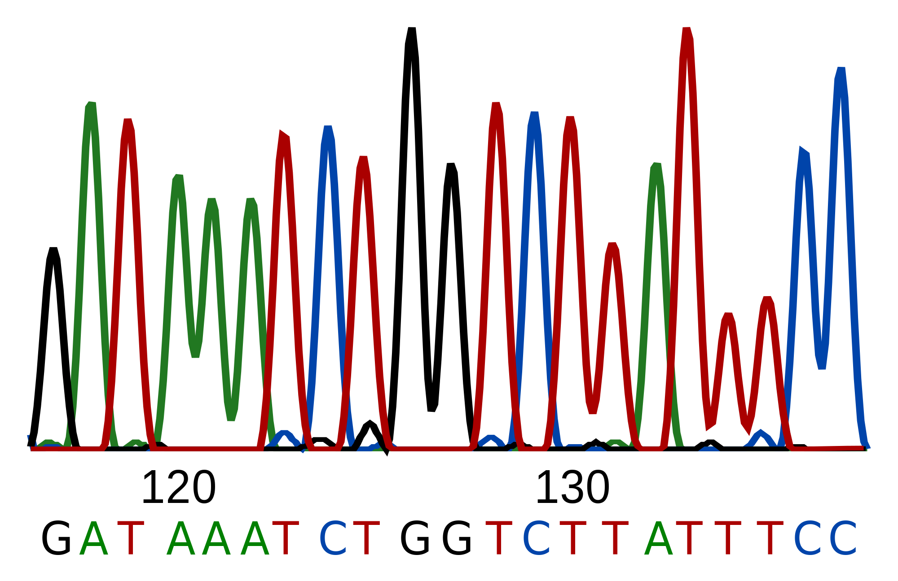

  </a>

## Mutation Finder

Assembles a genome and finds true mutations among sequencing errors.  

### Installation and running

* (Optional) Download and install [Bio-Linux](http://environmentalomics.org/bio-linux-download/), a specialised Ubuntu workstation  
* Download the Mutation Finder project  
* Compile the project: with an IDE or a makefile (TODO)  
* Adjust the settings in the settings.ini file to your liking  
* Place the settings.ini file and input files into the same folder  
* Run the program with: "./MutationFinder"  

### Folders

| Folder | |
| :---: | :--- |
| Docs: | Project documentation |
| Instructions: | Faculty provided instructions |
| MutationFinder: | Project folder |
| Research: | Research notes |
| Results: | Output files, mutation CSV files |
| TestData: | Faculty provided test data |

### Authors

[Josip Kasap](https://github.com/Kasap7)  
[Mislav Jaksic](https://github.com/MislavJaksic)  

### Faculty and course

University, faculty: [University of Zagreb, Faculty of Electrical Engineering and Computing](https://www.fer.unizg.hr/en)  
Course: [Bioinformatics](https://www.fer.unizg.hr/predmet/bio)
